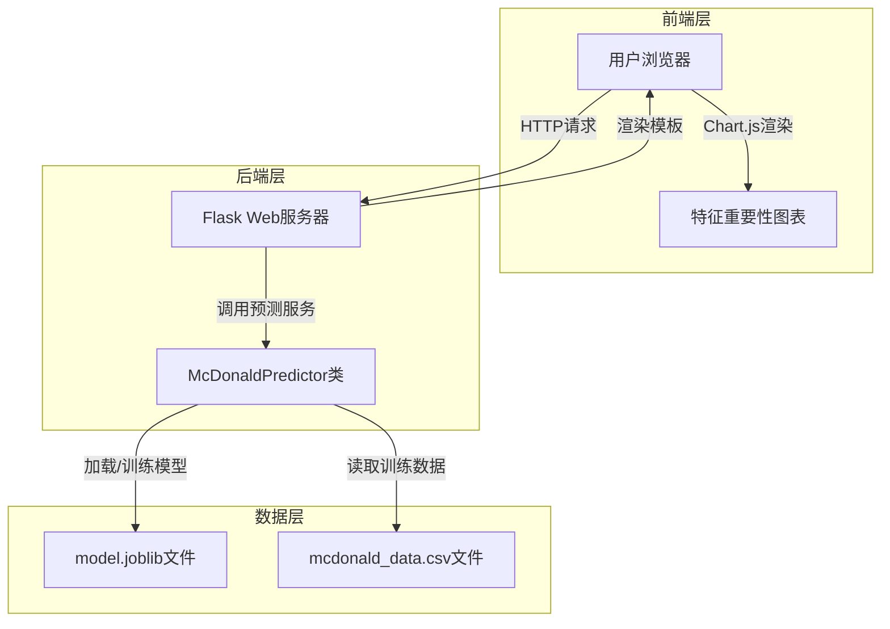
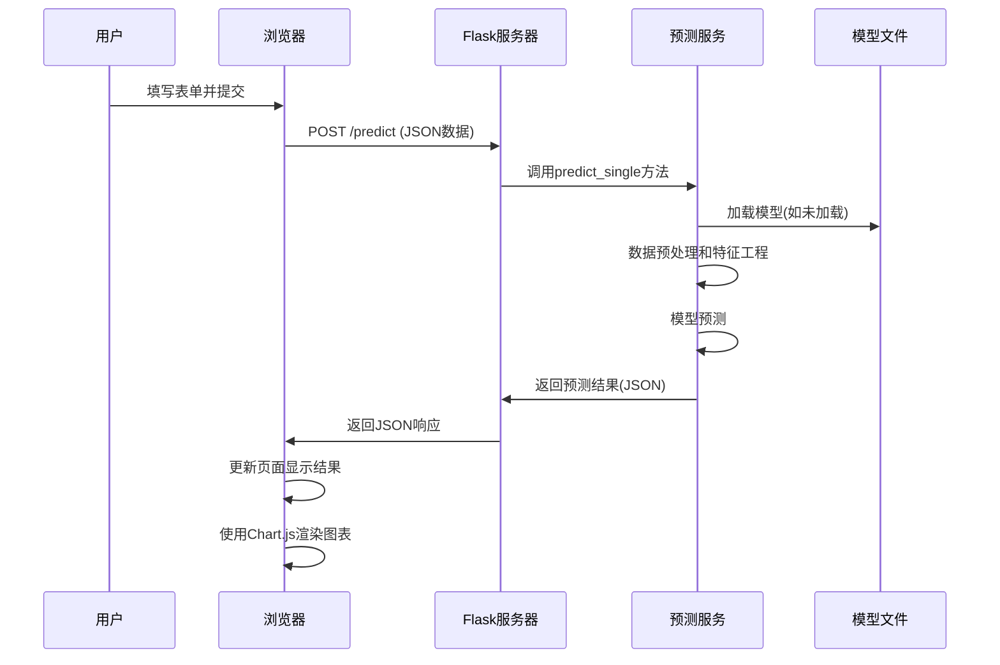

# McDonald喜好预测系统 - 架构分析文档

## 1. 系统架构图

## 2. 组件详细说明

### 2.1 前端层 (Frontend Layer)
- **用户浏览器**: 负责呈现用户界面和处理用户交互
- **特征重要性图表**: 使用Chart.js库可视化模型输出的特征重要性数据

### 2.2 后端层 (Backend Layer)
- **Flask Web服务器**: 处理HTTP请求，路由管理，模板渲染
- **McDonaldPredictor类**: 核心预测逻辑，包含模型训练、数据预处理和预测功能

### 2.3 数据层 (Data Layer)
- **model.joblib**: 序列化的机器学习模型文件，包含训练好的决策树模型
- **mcdonald_data.csv**: 原始训练数据文件，包含用户特征和标签

## 3. 数据流程示意图

## 4. 技术栈说明

| 层级 | 技术/工具 | 用途 |
|------|----------|------|
| 前端 | HTML/CSS/JavaScript | 页面结构和交互逻辑 |
| 前端 | Chart.js | 数据可视化，展示特征重要性 |
| 后端 | Python Flask | Web框架，处理HTTP请求 |
| 后端 | scikit-learn | 机器学习库，提供决策树分类器 |
| 后端 | pandas | 数据处理和分析库 |
| 后端 | joblib | 模型序列化和反序列化 |

## 5. 关键流程分析

### 5.1 模型训练流程
1. 应用启动时检查模型文件是否存在
2. 如不存在，读取训练数据进行预处理
3. 创建Pipeline包含数据标准化和决策树分类器
4. 训练模型并保存到model.joblib文件

### 5.2 预测流程
1. 接收前端POST请求的JSON数据
2. 转换为pandas DataFrame格式
3. 使用训练好的模型进行预测
4. 返回预测结果、置信度和特征重要性

### 5.3 前端渲染流程
1. 表单提交阻止默认行为
2. 使用Fetch API发送异步请求
3. 接收响应后更新结果显示区域
4. 创建Chart.js实例渲染特征重要性图表
