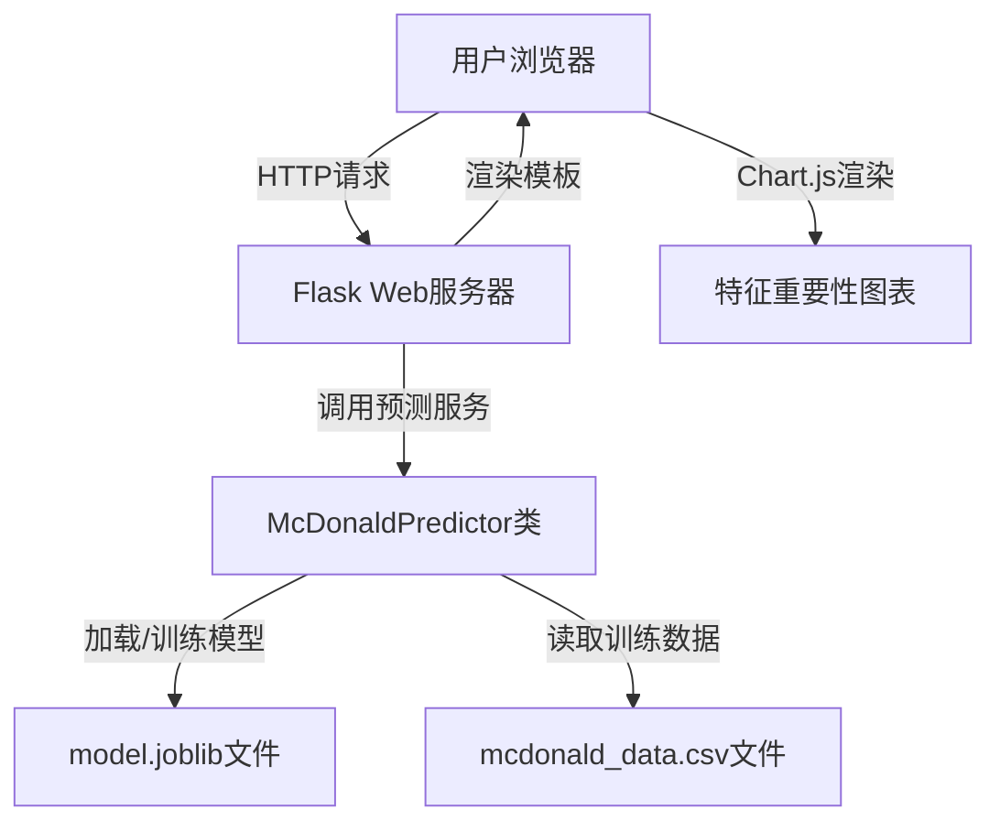
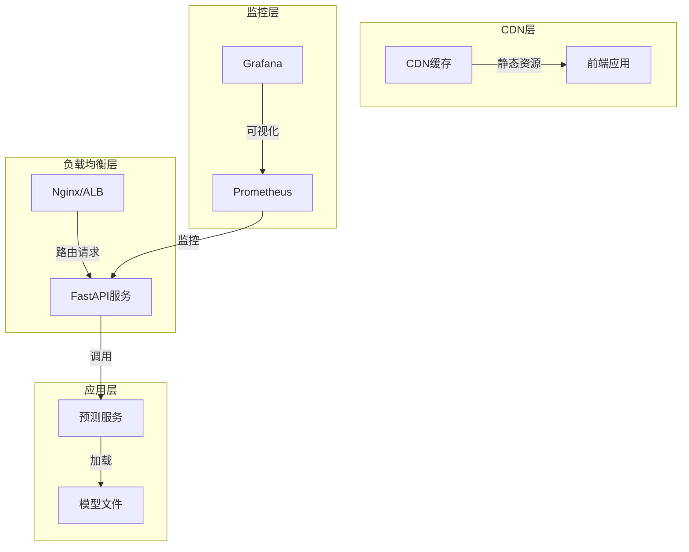

# McDonald喜好预测系统 - 架构分析与前后端分离实现方案

## 1. 架构分析

### 1.1 当前架构评估

#### 现有架构图


#### 架构问题分析
1. **紧耦合**: 前端代码与后端模板紧耦合，不利于独立开发和部署
2. **可扩展性差**: 难以添加新功能或进行性能优化
3. **状态管理缺失**: 前端状态完全依赖后端返回，无法实现复杂交互

---

## 2. 技术选型建议

### 2.1 前端技术栈推荐

| 技术 | 选型理由 | 替代方案 |
|------|---------|---------|
| **Vue 3 + Composition API** | 轻量级、学习曲线平缓、Composition API适合构建复杂组件 | React 18, Svelte |
| **Vite** | 极速开发体验、热更新速度快 | Webpack, Rollup |
| **Element Plus** | 丰富的UI组件库、与Vue 3完美集成 | Ant Design Vue, Vuetify |
| **Pinia** | Vue官方推荐的状态管理库、API简洁 | Vuex 4 |
| **Chart.js 4.x** | 轻量级图表库、配置简单、支持多种图表类型 | ECharts, Highcharts |

### 2.2 后端技术栈推荐

| 技术 | 选型理由 | 替代方案 |
|------|---------|---------|
| **FastAPI** | 高性能异步框架、自动生成API文档、类型安全 | Flask 2.x, Django REST Framework |
| **Uvicorn** | 高性能ASGI服务器 | Gunicorn + Uvicorn |
| **Pydantic** | 数据验证和序列化 | Marshmallow |
| **scikit-learn** | 机器学习库，决策树实现简单高效 | XGBoost, LightGBM |
| **joblib** | 模型序列化 | pickle |

### 2.3 部署架构推荐



---

## 3. 前后端分离完整实现方案

### 3.1 项目目录结构

```
mcdonald-predictor/
├── frontend/                    # 前端应用
│   ├── src/
│   │   ├── components/         # 组件目录
│   │   │   ├── PredictionForm.vue
│   │   │   └── FeatureChart.vue
│   │   ├── stores/             # Pinia状态管理
│   │   │   └── prediction.ts
│   │   ├── services/           # API服务
│   │   │   └── api.ts
│   │   ├── App.vue
│   │   └── main.ts
│   ├── public/
│   ├── package.json
│   ├── vite.config.ts
│   └── tsconfig.json
├── backend/                     # 后端应用
│   ├── app/
│   │   ├── api/                # API路由
│   │   │   └── v1/
│   │   │       └── prediction.py
│   │   ├── core/               # 核心配置
│   │   │   └── config.py
│   │   ├── services/           # 业务服务
│   │   │   └── predictor.py
│   │   ├── schemas/            # Pydantic模型
│   │   │   └── prediction.py
│   │   └── main.py
│   ├── models/                 # 模型文件
│   │   └── model.joblib
│   ├── requirements.txt
│   └── Dockerfile
└── docker-compose.yml          # 本地开发环境
```

---

### 3.2 前端完整实现代码

#### 3.2.1 API服务层 (`frontend/src/services/api.ts`)

```typescript
import axios from 'axios';

const API_BASE_URL = import.meta.env.VITE_API_BASE_URL || 'http://localhost:8000';

const api = axios.create({
  baseURL: API_BASE_URL,
  headers: {
    'Content-Type': 'application/json',
  },
  timeout: 10000,
});

// 请求拦截器
api.interceptors.request.use(
  (config) => {
    console.log('[API Request]', config.method?.toUpperCase(), config.url);
    return config;
  },
  (error) => {
    console.error('[API Request Error]', error);
    return Promise.reject(error);
  }
);

// 响应拦截器
api.interceptors.response.use(
  (response) => {
    console.log('[API Response]', response.status, response.data);
    return response.data;
  },
  (error) => {
    console.error('[API Response Error]', error.response?.status, error.message);
    return Promise.reject(error);
  }
);

// 预测API
export const predictionApi = {
  predict: (data: { age: number; visit_frequency: number }) => 
    api.post('/api/v1/prediction', data),
  
  getHealth: () => 
    api.get('/health'),
};

export default api;
```

#### 3.2.2 状态管理 (`frontend/src/stores/prediction.ts`)

```typescript
import { defineStore } from 'pinia';
import { predictionApi } from '../services/api';

interface PredictionState {
  loading: boolean;
  error: string | null;
  result: {
    prediction: number;
    confidence: number;
    feature_importance: Record<string, number>;
  } | null;
  history: Array<{
    timestamp: Date;
    input: { age: number; visit_frequency: number };
    result: any;
  }>;
}

export const usePredictionStore = defineStore('prediction', {
  state: (): PredictionState => ({
    loading: false,
    error: null,
    result: null,
    history: [],
  }),

  getters: {
    hasResult: (state) => !!state.result,
    predictionText: (state) => {
      if (!state.result) return '';
      return state.result.prediction ? '喜欢' : '不喜欢';
    },
    confidencePercentage: (state) => {
      if (!state.result) return 0;
      return Math.round(state.result.confidence * 100);
    },
  },

  actions: {
    async submitPrediction(data: { age: number; visit_frequency: number }) {
      this.loading = true;
      this.error = null;

      try {
        const response = await predictionApi.predict(data);
        this.result = response.data;
        
        // 保存历史记录
        this.history.unshift({
          timestamp: new Date(),
          input: data,
          result: response.data,
        });

        // 限制历史记录数量
        if (this.history.length > 10) {
          this.history = this.history.slice(0, 10);
        }
      } catch (error: any) {
        this.error = error.response?.data?.detail || '预测失败，请稍后重试';
        this.result = null;
      } finally {
        this.loading = false;
      }
    },

    clearResult() {
      this.result = null;
      this.error = null;
    },
  },
});
```

#### 3.2.3 预测表单组件 (`frontend/src/components/PredictionForm.vue`)

```vue
<template>
  <el-card class="prediction-form-card">
    <template #header>
      <span class="card-title">用户喜好预测</span>
    </template>

    <el-form
      ref="formRef"
      :model="formData"
      :rules="rules"
      label-position="top"
      @submit.prevent="handleSubmit"
    >
      <el-form-item label="年龄" prop="age">
        <el-input-number
          v-model="formData.age"
          :min="0"
          :max="120"
          placeholder="请输入年龄"
          style="width: 100%"
        />
      </el-form-item>

      <el-form-item label="每月访问次数" prop="visit_frequency">
        <el-input-number
          v-model="formData.visit_frequency"
          :min="0"
          :max="100"
          placeholder="请输入每月访问次数"
          style="width: 100%"
        />
      </el-form-item>

      <el-form-item>
        <el-button
          type="primary"
          :loading="loading"
          :disabled="loading"
          @click="handleSubmit"
          style="width: 100%"
        >
          {{ loading ? '预测中...' : '开始预测' }}
        </el-button>
      </el-form-item>
    </el-form>

    <!-- 错误提示 -->
    <el-alert
      v-if="error"
      :title="error"
      type="error"
      show-icon
      closable
      style="margin-top: 16px"
    />

    <!-- 预测结果 -->
    <div v-if="result" class="result-section">
      <el-divider content-position="left">预测结果</el-divider>
      
      <el-row :gutter="20">
        <el-col :span="12">
          <el-statistic
            title="预测结果"
            :value="predictionText"
            value-style="color: #409eff"
          />
        </el-col>
        <el-col :span="12">
          <el-statistic
            title="置信度"
            :value="confidencePercentage"
            suffix="%"
            value-style="color: #67c23a"
          />
        </el-col>
      </el-row>

      <el-progress
        :percentage="confidencePercentage"
        :status="confidencePercentage > 80 ? 'success' : confidencePercentage > 60 ? 'warning' : 'exception'"
        style="margin-top: 16px"
      />
    </div>
  </el-card>
</template>

<script setup lang="ts">
import { ref, computed } from 'vue';
import { usePredictionStore } from '../stores/prediction';
import type { FormInstance, FormRules } from 'element-plus';

const formRef = ref<FormInstance>();
const store = usePredictionStore();

const formData = ref({
  age: 25,
  visit_frequency: 2,
});

const rules: FormRules = {
  age: [
    { required: true, message: '请输入年龄', trigger: 'blur' },
    { type: 'number', min: 0, max: 120, message: '年龄范围应为0-120', trigger: 'blur' },
  ],
  visit_frequency: [
    { required: true, message: '请输入访问次数', trigger: 'blur' },
    { type: 'number', min: 0, max: 100, message: '访问次数范围应为0-100', trigger: 'blur' },
  ],
};

const loading = computed(() => store.loading);
const error = computed(() => store.error);
const result = computed(() => store.result);
const predictionText = computed(() => store.predictionText);
const confidencePercentage = computed(() => store.confidencePercentage);

const handleSubmit = async () => {
  if (!formRef.value) return;
  
  await formRef.value.validate(async (valid) => {
    if (valid) {
      await store.submitPrediction(formData.value);
    }
  });
};
</script>

<style scoped>
.prediction-form-card {
  max-width: 500px;
  margin: 0 auto;
}

.card-title {
  font-size: 18px;
  font-weight: 600;
}

.result-section {
  margin-top: 20px;
}
</style>
```

#### 3.2.4 特征图表组件 (`frontend/src/components/FeatureChart.vue`)

```vue
<template>
  <el-card class="feature-chart-card">
    <template #header>
      <span class="card-title">特征重要性分析</span>
    </template>

    <div v-if="featureImportance" class="chart-container">
      <canvas ref="chartRef"></canvas>
    </div>

    <div v-else class="empty-state">
      <el-empty description="请先进行预测查看特征重要性" />
    </div>
  </el-card>
</template>

<script setup lang="ts">
import { ref, computed, watch, onUnmounted } from 'vue';
import { usePredictionStore } from '../stores/prediction';
import { Chart, registerables } from 'chart.js';

Chart.register(...registerables);

const chartRef = ref<HTMLCanvasElement | null>(null);
const store = usePredictionStore();
let chartInstance: Chart | null = null;

const featureImportance = computed(() => store.result?.feature_importance);

const destroyChart = () => {
  if (chartInstance) {
    chartInstance.destroy();
    chartInstance = null;
  }
};

const renderChart = (data: Record<string, number>) => {
  if (!chartRef.value) return;

  destroyChart();

  const labels = Object.keys(data);
  const values = Object.values(data);

  chartInstance = new Chart(chartRef.value, {
    type: 'bar',
    data: {
      labels: labels.map(label => label === 'age' ? '年龄' : label === 'visit_frequency' ? '访问频率' : label),
      datasets: [
        {
          label: '特征重要性',
          data: values,
          backgroundColor: [
            'rgba(54, 162, 235, 0.7)',
            'rgba(255, 99, 132, 0.7)',
            'rgba(255, 206, 86, 0.7)',
          ],
          borderColor: [
            'rgba(54, 162, 235, 1)',
            'rgba(255, 99, 132, 1)',
            'rgba(255, 206, 86, 1)',
          ],
          borderWidth: 1,
        },
      ],
    },
    options: {
      responsive: true,
      maintainAspectRatio: false,
      plugins: {
        legend: {
          position: 'top',
        },
        title: {
          display: true,
          text: '模型特征重要性分布',
        },
      },
      scales: {
        y: {
          beginAtZero: true,
          max: 1,
          title: {
            display: true,
            text: '重要性权重',
          },
        },
      },
    },
  });
};

watch(
  featureImportance,
  (newData) => {
    if (newData) {
      renderChart(newData);
    } else {
      destroyChart();
    }
  },
  { immediate: true }
);

onUnmounted(() => {
  destroyChart();
});
</script>

<style scoped>
.feature-chart-card {
  margin-top: 20px;
}

.card-title {
  font-size: 18px;
  font-weight: 600;
}

.chart-container {
  height: 300px;
  padding: 20px;
}

.empty-state {
  height: 300px;
  display: flex;
  align-items: center;
  justify-content: center;
}
</style>
```

---

### 3.3 后端完整实现代码

#### 3.3.1 主应用文件 (`backend/app/main.py`)

```python
from fastapi import FastAPI
from fastapi.middleware.cors import CORSMiddleware
from fastapi.responses import RedirectResponse
from app.api.v1.prediction import router as prediction_router
from app.core.config import settings

app = FastAPI(
    title=settings.PROJECT_NAME,
    description="McDonald用户喜好预测API",
    version="1.0.0",
    docs_url="/docs",
    redoc_url="/redoc",
)

# CORS配置
app.add_middleware(
    CORSMiddleware,
    allow_origins=settings.ALLOWED_ORIGINS,
    allow_credentials=True,
    allow_methods=["*"],
    allow_headers=["*"],
)

# API路由
app.include_router(prediction_router, prefix="/api/v1", tags=["预测"])

# 健康检查
@app.get("/health", tags=["系统"])
async def health_check():
    """健康检查接口"""
    return {"status": "healthy", "service": "mcdonald-prediction-api"}

# 根路径重定向到API文档
@app.get("/", include_in_schema=False)
async def root():
    return RedirectResponse(url="/docs")

if __name__ == "__main__":
    import uvicorn
    uvicorn.run(
        "main:app",
        host=settings.HOST,
        port=settings.PORT,
        reload=settings.DEBUG,
        workers=settings.WORKERS,
    )
```

#### 3.3.2 配置文件 (`backend/app/core/config.py`)

```python
from pydantic_settings import BaseSettings
from typing import List

class Settings(BaseSettings):
    """应用配置"""
    PROJECT_NAME: str = "McDonald Prediction API"
    DEBUG: bool = True
    HOST: str = "0.0.0.0"
    PORT: int = 8000
    WORKERS: int = 1
    
    # CORS配置
    ALLOWED_ORIGINS: List[str] = [
        "http://localhost:3000",
        "http://127.0.0.1:3000",
    ]
    
    # 模型配置
    MODEL_PATH: str = "models/model.joblib"
    DATA_PATH: str = "data/mcdonald_data.csv"
    
    class Config:
        env_file = ".env"

settings = Settings()
```

#### 3.3.3 预测API路由 (`backend/app/api/v1/prediction.py`)

```python
from fastapi import APIRouter, HTTPException
from app.schemas.prediction import (
    PredictionRequest,
    PredictionResponse,
    PredictionResult,
)
from app.services.predictor import McDonaldPredictor

router = APIRouter()
predictor = McDonaldPredictor()

@router.post(
    "/prediction",
    response_model=PredictionResponse,
    summary="用户喜好预测",
    description="根据用户年龄和访问频率预测是否喜欢麦当劳",
)
async def create_prediction(request: PredictionRequest):
    """
    创建预测请求
    
    - **age**: 用户年龄 (0-120)
    - **visit_frequency**: 每月访问次数 (0-100)
    """
    try:
        result = predictor.predict(
            age=request.age,
            visit_frequency=request.visit_frequency,
        )
        
        return PredictionResponse(
            success=True,
            data=PredictionResult(**result),
            message="预测成功",
        )
    except Exception as e:
        raise HTTPException(
            status_code=500,
            detail=f"预测失败: {str(e)}",
        )

@router.get(
    "/prediction/model-info",
    summary="获取模型信息",
    description="获取当前使用的模型信息",
)
async def get_model_info():
    """获取模型信息"""
    try:
        info = predictor.get_model_info()
        return {
            "success": True,
            "data": info,
            "message": "获取模型信息成功",
        }
    except Exception as e:
        raise HTTPException(
            status_code=500,
            detail=f"获取模型信息失败: {str(e)}",
        )
```

#### 3.3.4 Pydantic数据模型 (`backend/app/schemas/prediction.py`)

```python
from pydantic import BaseModel, Field, validator
from typing import Dict, Optional

class PredictionRequest(BaseModel):
    """预测请求模型"""
    age: int = Field(
        ...,
        ge=0,
        le=120,
        description="用户年龄",
        example=25,
    )
    visit_frequency: int = Field(
        ...,
        ge=0,
        le=100,
        description="每月访问次数",
        example=2,
    )

class PredictionResult(BaseModel):
    """预测结果模型"""
    prediction: int = Field(..., description="预测结果 (0=不喜欢, 1=喜欢)")
    confidence: float = Field(..., description="置信度 (0-1)")
    feature_importance: Dict[str, float] = Field(
        ...,
        description="特征重要性字典",
        example={"age": 0.6, "visit_frequency": 0.4},
    )

class PredictionResponse(BaseModel):
    """预测响应模型"""
    success: bool = Field(..., description="是否成功")
    data: Optional[PredictionResult] = Field(None, description="预测结果数据")
    message: str = Field(..., description="响应消息")
```

#### 3.3.5 预测服务 (`backend/app/services/predictor.py`)

```python
import os
import joblib
import pandas as pd
from sklearn.pipeline import Pipeline
from sklearn.preprocessing import StandardScaler
from sklearn.tree import DecisionTreeClassifier
from app.core.config import settings

class McDonaldPredictor:
    """麦当劳喜好预测服务"""
    
    def __init__(self):
        """初始化预测服务"""
        self.model: Optional[Pipeline] = None
        self._load_model()
    
    def _load_model(self) -> None:
        """加载训练好的模型"""
        try:
            if os.path.exists(settings.MODEL_PATH):
                self.model = joblib.load(settings.MODEL_PATH)
                print(f"模型加载成功: {settings.MODEL_PATH}")
            else:
                print("模型不存在，开始训练...")
                self._train_model()
        except Exception as e:
            raise RuntimeError(f"模型加载失败: {str(e)}")
    
    def _train_model(self) -> None:
        """训练模型"""
        try:
            # 读取数据
            if not os.path.exists(settings.DATA_PATH):
                raise FileNotFoundError(f"训练数据不存在: {settings.DATA_PATH}")
            
            data = pd.read_csv(settings.DATA_PATH)
            
            # 数据预处理
            processed_data = self._preprocess_data(data)
            
            # 分离特征和标签
            X = processed_data.drop("likes_mcdonald", axis=1)
            y = processed_data["likes_mcdonald"]
            
            # 创建模型管道
            self.model = Pipeline([
                ("scaler", StandardScaler()),
                ("classifier", DecisionTreeClassifier(max_depth=5, random_state=42)),
            ])
            
            # 训练模型
            self.model.fit(X, y)
            
            # 保存模型
            os.makedirs(os.path.dirname(settings.MODEL_PATH), exist_ok=True)
            joblib.dump(self.model, settings.MODEL_PATH)
            print(f"模型训练完成并保存: {settings.MODEL_PATH}")
            
        except Exception as e:
            raise RuntimeError(f"模型训练失败: {str(e)}")
    
    def _preprocess_data(self, data: pd.DataFrame) -> pd.DataFrame:
        """数据预处理"""
        return data[
            (data["age"] >= 18) & 
            (data["visit_frequency"] > 0)
        ].dropna()
    
    def predict(self, age: int, visit_frequency: int) -> dict:
        """
        进行预测
        
        Args:
            age: 用户年龄
            visit_frequency: 每月访问次数
        
        Returns:
            预测结果字典
        """
        if self.model is None:
            raise RuntimeError("模型未加载")
        
        try:
            # 创建输入DataFrame
            input_data = pd.DataFrame([{
                "age": age,
                "visit_frequency": visit_frequency,
            }])
            
            # 进行预测
            probabilities = self.model.predict_proba(input_data)[0]
            prediction = self.model.predict(input_data)[0]
            
            # 获取特征重要性
            feature_importance = dict(zip(
                input_data.columns,
                self.model.named_steps["classifier"].feature_importances_,
            ))
            
            return {
                "prediction": int(prediction),
                "confidence": float(max(probabilities)),
                "feature_importance": feature_importance,
            }
            
        except Exception as e:
            raise RuntimeError(f"预测失败: {str(e)}")
    
    def get_model_info(self) -> dict:
        """获取模型信息"""
        if self.model is None:
            raise RuntimeError("模型未加载")
        
        classifier = self.model.named_steps["classifier"]
        
        return {
            "model_type": type(classifier).__name__,
            "max_depth": classifier.max_depth,
            "n_features": classifier.n_features_in_,
            "feature_importance": dict(zip(
                ["age", "visit_frequency"],
                classifier.feature_importances_,
            )),
        }
```

---

## 4. 部署与运行

### 4.1 本地开发环境

1. **启动后端服务**:
```bash
cd backend
pip install -r requirements.txt
python main.py
```

2. **启动前端服务**:
```bash
cd frontend
npm install
npm run dev
```

3. **访问应用**:
- 前端: http://localhost:3000
- API文档: http://localhost:8000/docs

### 4.2 Docker部署

```yaml
version: '3.8'
services:
  backend:
    build: ./backend
    ports:
      - "8000:8000"
    environment:
      - DEBUG=false
    volumes:
      - ./backend/models:/app/models
    restart: unless-stopped

  frontend:
    build: ./frontend
    ports:
      - "3000:80"
    depends_on:
      - backend
    restart: unless-stopped
```

---

## 5. 性能与可维护性优化建议

1. **缓存策略**: 对模型预测结果进行缓存，减少重复计算
2. **异步处理**: 对于复杂的预测任务，使用消息队列进行异步处理
3. **监控告警**: 添加Prometheus监控和Grafana可视化，设置告警规则
4. **日志管理**: 集成ELK或Loki进行日志收集和分析
5. **测试覆盖**: 编写单元测试和集成测试，确保代码质量
6. **CI/CD**: 配置自动化构建和部署流程
